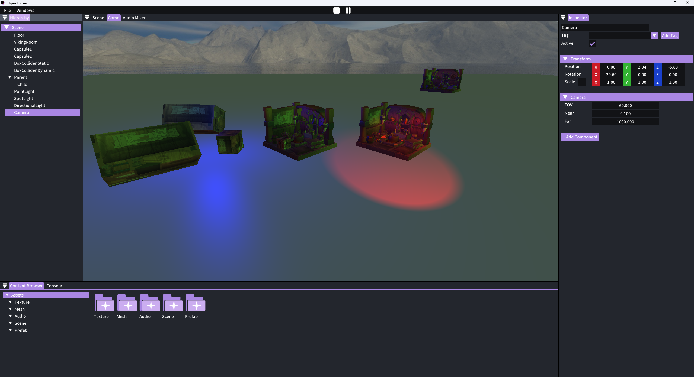
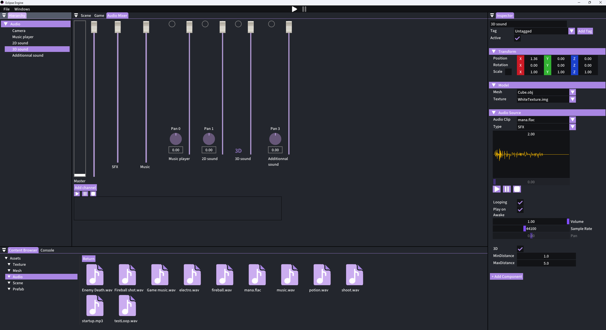
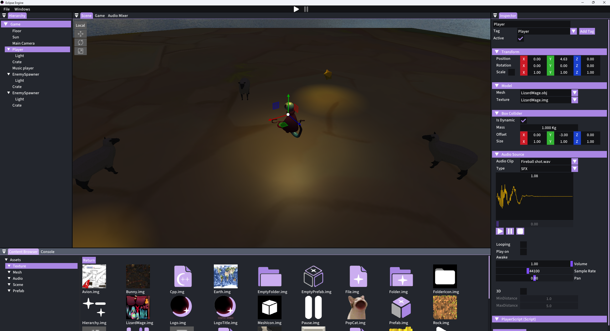
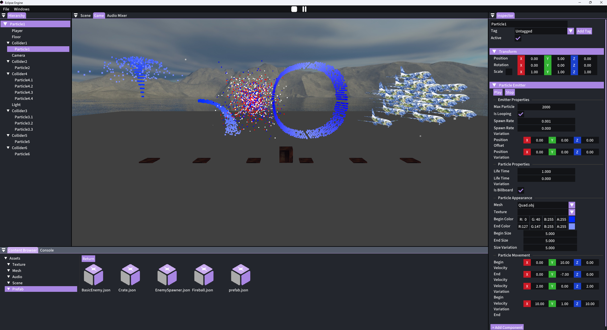
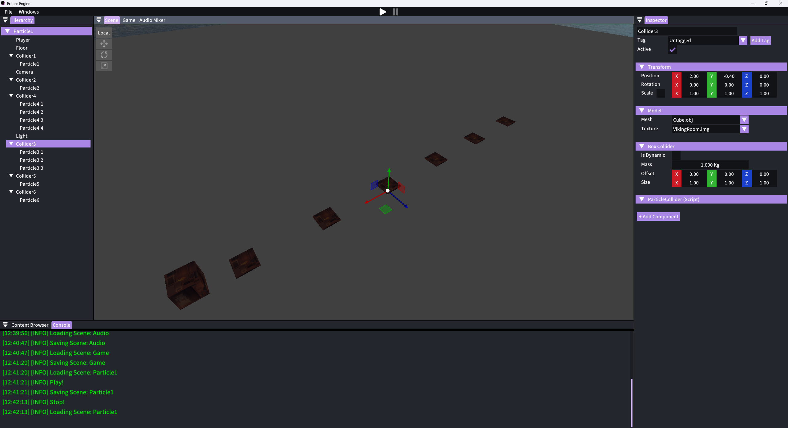

#  Eclipse Engine

The goal of this project was to create a game engine with an editor.

## 📝 Informations

We were 3 and had 3 months to create a game engine and its editor, using external libraries and our own code.

This project was made using c++ 20 and Visual Studio 2022.

## 📖​ Libraries

### 💻​ Rendering
- [ImGUI](https://github.com/ocornut/imgui) with [ImGuizmo](https://github.com/CedricGuillemet/ImGuizmo) and [ImGui-Knobs](https://github.com/altschuler/imgui-knobs)
- [GLFW](https://www.glfw.org/)
- [Glad](https://glad.dav1d.de/)

### 🔄 Loaders
- [TinyObjLoader](https://github.com/tinyobjloader/tinyobjloader)
- [Stb](https://github.com/nothings/stb)

### 🚀​ Physics
- [Jolt Physics](https://github.com/jrouwe/JoltPhysics)

### 🔊​ Audio
- [SoLoud](https://solhsa.com/soloud/)

### 📑​ Serialization
- [Json](https://github.com/nlohmann/json)

## 🛒 Assets

### 💎 Models
- [Lizard Mage model](https://sketchfab.com/3d-models/lizard-mage-817d52d9887948bfa0ca43aef6064eaa)
- [Star](https://poly.pizza/m/0ddNZ3EsIhw) by Poly by Google [CC-BY](https://creativecommons.org/licenses/by/3.0/) via Poly Pizza
- [Wolf](https://poly.pizza/m/45wMLZn4kj1) by Poly by Google [CC-BY](https://creativecommons.org/licenses/by/3.0/) via Poly Pizza
- [Sheep](https://poly.pizza/m/dXBMV4AY2DL) by Poly by Google [CC-BY](https://creativecommons.org/licenses/by/3.0/) via Poly Pizza

### 🎧 Sounds
- [Wolf sound](https://freesound.org/people/xpoki/sounds/432753/)
- [Fireball sound](https://freesound.org/people/HighPixel/sounds/431174/)
- [Fireball sound 2](https://freesound.org/people/Julien_Matthey/sounds/346916/)
- [Fireball sound 3](https://freesound.org/people/NearTheAtmoshphere/sounds/683179/)
- [Mana sound](https://freesound.org/people/qubodup/sounds/172590/)
- [Potion sound](https://freesound.org/people/Jamius/sounds/41529/)
- [Electro music](https://freesound.org/people/CVLTIV8R/sounds/805149/)
- [Game music](https://freesound.org/people/User391915396/sounds/399034/)
- [Audio demo music](https://freesound.org/people/kjartan_abel/sounds/647212/)
- [Editor jingle](https://freesound.org/people/chiptraxxx/sounds/415012/)

## ⚠️ Requirements

The project needs Git and CMake installed, and internet access.

## ​🌘​ Authors

### Programmers
- [Arthur GUÉDU](https://github.com/Arthur-GUEDU)
- [Lucas LEPINAY](https://github.com/LucasLEPINAY)
- [Yanis SCHWARZ](https://github.com/YanisSwz)

### Artist
- Noémie Mermet

## 📷 Gallery

