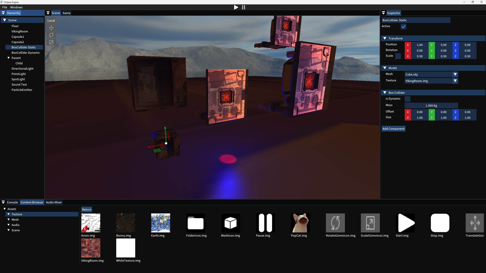
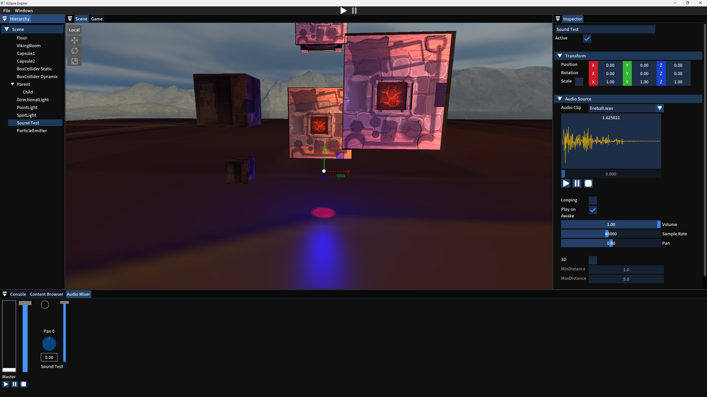
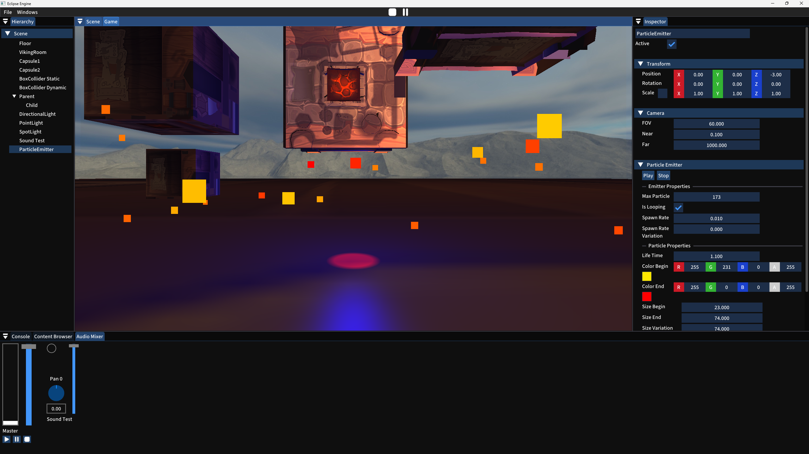
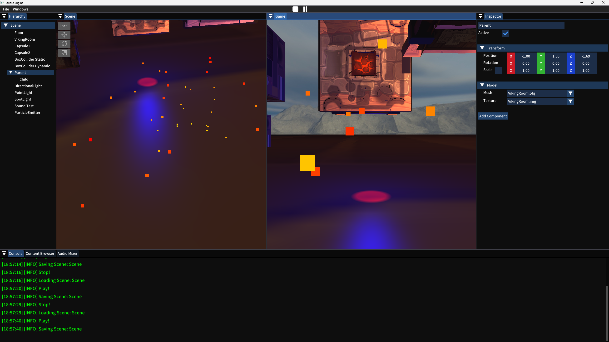
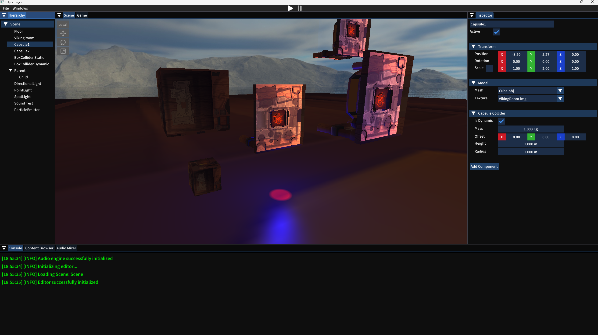

#  Eclipse Engine

The goal of this project is to create a game engine and a game editor.

## 📝 Informations

We were 3 and had 3 months to create a game engine and its editor, using external libraries and our own code.

This project was made using c++ 20 and Visual Studio 2022.

## 📖​ Libraries

### 💻​ Rendering
- [ImGUI](https://github.com/ocornut/imgui) with [ImGuizmo](https://github.com/CedricGuillemet/ImGuizmo) and [ImGui-Knobs](https://github.com/altschuler/imgui-knobs)
- [GLFW](https://www.glfw.org/)
- [Glad](https://glad.dav1d.de/)

### 🚀​ Physics
- [Jolt Physics](https://github.com/jrouwe/JoltPhysics)

### 🔊​ Audio
- [SoLoud](https://solhsa.com/soloud/)

### 📑​ Serialization
- [Json](https://github.com/nlohmann/json)

## ⚠️ Requirements

The project needs Git and CMake installed, and internet access.

## ​🌘​ Authors

### Programmers
- [Arthur GUEDU](https://gitlabstudents.isartintra.com/a.guedu)
- [Lucas LEPINAY](https://gitlabstudents.isartintra.com/l.lepinay)
- [Yanis SCHWARZ](https://gitlabstudents.isartintra.com/y.schwarz)

### Artist
- Noémie Mermet

## 📷 Gallery

